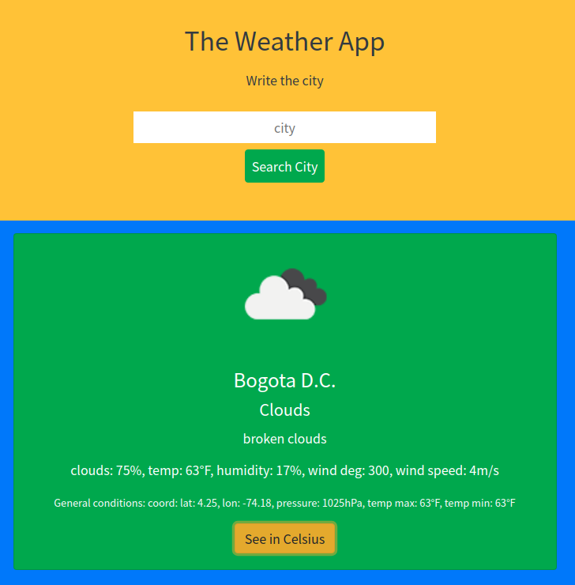

**The Weather App**

The Weather App is a project that comes with Asynchronous Javascript using the openWeather API along with the usage of promises, and async/await syntax too. the look of the results is based on the fetched data, adding the image that describes the weather.

## Live Preview

[The Weather App](https://javierbotero.github.io/weatherApp/)


## Built With

- Webpack
- Javascript
- CSS
- HTML5

## Getting start

In order to start with the project:

1. Install npm in your machine.
2. Clone [this repository](https://github.com/javierbotero/weatherApp.git)
3. cd inside the project

4. Run
```
  npm i
```
in the terminal to install the dependencies.


## Author

👤 **Javier Botero**

- Github: [@Javierbotero](https://github.com/javierbotero)
- Twitter: [@Javierbotero1](https://twitter.com/Javierboterodev)
- Linkedin: [Javierbotero](https://www.linkedin.com/in/javierboterodev/)

## 🤝 Contributing

Contributions, issues and feature requests are welcome!

## Show your support

Give a ⭐️ if you like this project!